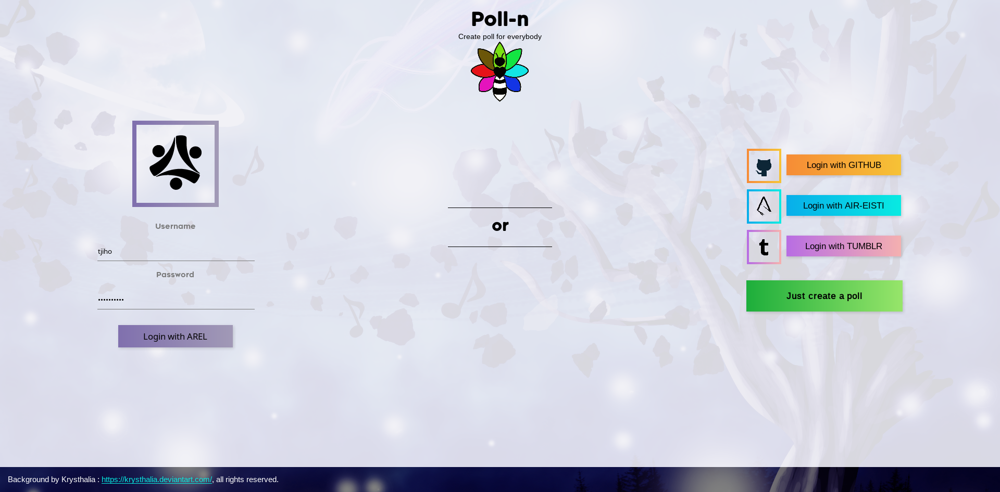
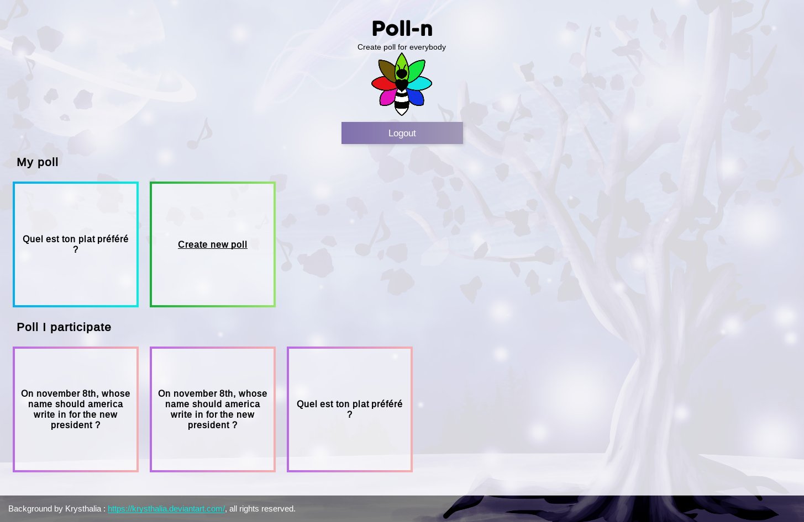
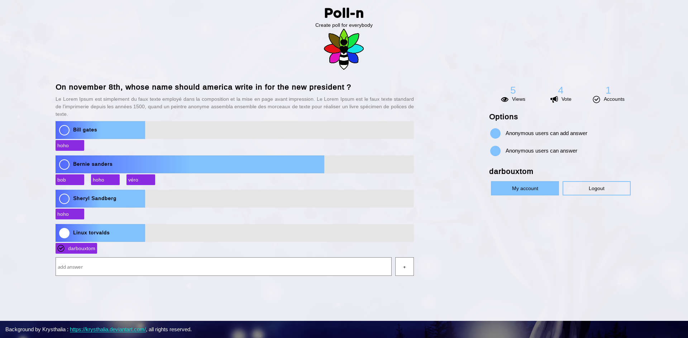

Poll-n
======




All the code is under the Mozilla Public License Version 2.0.

Fonts are under there own licenses.

The image named "draw.png" is the property of "Krystalia" : https://krysthalia.deviantart.com/, all right reserved.

install
-------

Before launching pip, you need to install `python3-devel` with your package manager

Fedora / Arch-linux:
```
pip install -r requirements.txt
```

Debian / Open-suse leap
```
pip3 install -r requirements.txt
```

It should work on windows, you need to install python 3 and pip for windows and do the same as fedora command.

start
-----


Fedora / Arch-linux:
```
cd polln
python manage.py runserver
docker run -p 6379:6379 -d redis:2.8
```

Debian / Open-suse leap
```
cd polln
python3 manage.py runserver
docker run -p 6379:6379 -d redis:2.8
```

Update css
----------
```
sudo npm install stylus -g
stylus -w themes/main.styl -o polln/webApp/static/webApp/style.css
```

Images
------






